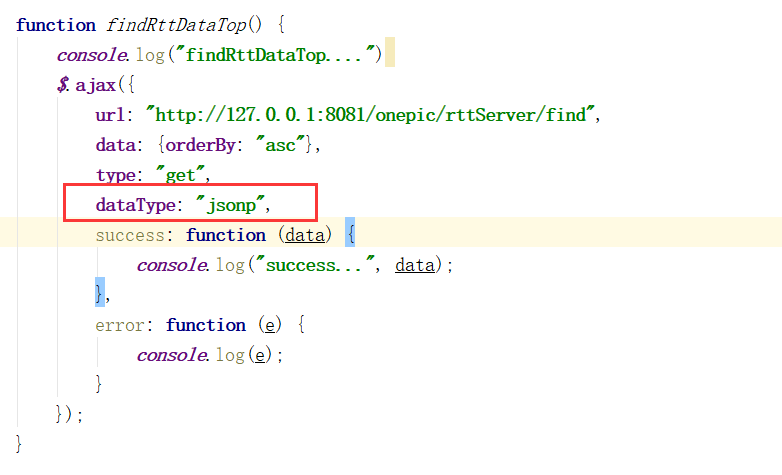

# 对外接口文档
**修改记录**：

| 序号 |   内容   | 修改人 |    时间    | 版本号  |
| :--: | :------: | :----: | :--------: | :-----: |
|  1   | 创建文档 | 金生旺 | 2019-03-18 | V-0.0.1 |
|  2   |          |        |            |         |
|      |          |        |            |         |

[TOC]


## 路况专题图

> 测试环境接口地址：http://192.168.251.183/onepic
>
> 生产环境接口地址：http://map.xjjt.gov.cn/onepic

### 拥堵排名

- 描述：查询拥堵排名信息

- 地址：

  生产地址: http://map.xjjt.gov.cn/onepic/rttServer/find   

  测试地址: http://192.168.251.183/onepic/rttServer/find 

- 参数：无

- 返回结果：

  为json格式：

  ```json
  [{"niLinkID":"","rLengt":"","orderBy":"","direction":"","endzh":176592.81721461198,"flowLos":"3","sectionLos":"","kind":"","roadName":"吐和高速","sectionStartlen":"","sectionDegreelen":"","createtime":1552889719000,"id":"3C7D84A87CD340E99DA049F2D9D7223F","startzh":166097.22652756123,"flowAffectlen":"10321","rticId":"2002","length":"","flowTraveltime":"941","nid":"3a3f2f86-3f04-41d8-a570-3eb2e97ac542","enodeID":"","code":"","snodeID":"","endPointNB":"87.62220526887114,42.221759261586875","niLinkLength":"","startPointNB":"87.74698963973152,42.21580597415089","rticLinkKind":"","flowStartlen":"10321","linkId":"","endPoint":"87.6222043185764,42.22169325086806","rticLinkID":"","includeStr":"[{\"NILinkID\":\"7402117\",\"NILinkLength\":\"1855\"},{\"NILinkID\":\"7402141\",\"NILinkLength\":\"55\"},{\"NILinkID\":\"7402139\",\"NILinkLength\":\"20\"},{\"NILinkID\":\"7402126\",\"NILinkLength\":\"899\"},{\"NILinkID\":\"7402134\",\"NILinkLength\":\"4078\"},{\"NILinkID\":\"12834454\",\"NILinkLength\":\"2943\"},{\"NILinkID\":\"12834453\",\"NILinkLength\":\"455\"},{\"NILinkID\":\"7402119\",\"NILinkLength\":\"16\"}]","batch":"2019-03-18 14:15:18","roadCode":"G3012","endNiLinkID":"","clazz":"","startNiLinkID":"","startPoint":"87.74699191623264,42.215746527777775"},{...}]
             
  ```

  字段说明：

  |      字段      |  字段  |      用途      |
  | :------------: | :----: | :------------: |
  |       id       | 字符串 |     唯一ID     |
  |    roadCode    | 字符串 |    线路编号    |
  |    roadName    | 字符串 |    线路名称    |
  |  flowStartlen  | 字符串 | 拥堵长度（米） |
  | flowTraveltime | 字符串 | 拥堵时长（秒） |
  |    startzh     | 字符串 | 起始桩号（米） |
  |     endzh      | 字符串 | 终止桩号（米） |
  |      ...       |        |                |

  返回json数组，只需要关注上边表格中的字段就可以，其他字段不需要关注

- 调用示例：

  

- 注意事项：

  - 按照拥堵长度和拥堵时长排序，请在前端js中实现。
  - 调用该接口时，请注意跨域问题
  - 在测试该接口时，需要在接口服务器的同一个网段

