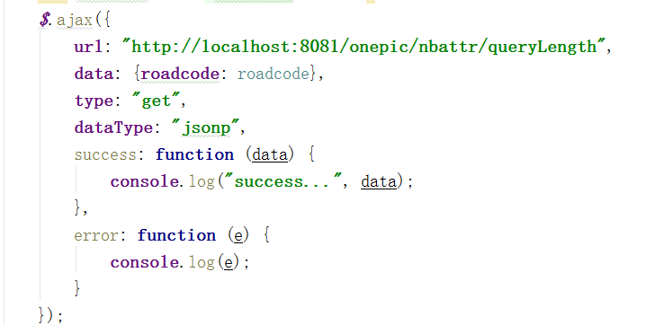

# 综合地图--接口文档
**修改记录**：

| 序号 |   内容   | 修改人 |    时间    | 版本号  |
| :--: | :------: | :----: | :--------: | :-----: |
|  1   | 创建文档 | 金生旺 | 2018-11-28 | V-0.0.1 |
|      |          |        |            |         |
|      |          |        |            |         |

[TOC]


## 事件

### 结果列表全部地图渲染

* 名称：**searchFeatures**

* 用途：专题图查询列表（10个点）渲染到地图上

* 参数：

  **features：features是一个feature数组**，例如[feature,feature]。

  参数需要如下前置转换：

  ```javascript
  var _pointStr = "" + _point[0] + "," + _point[1];
  var position = Utils.getWKTPoint(_pointStr);
  feature = Utils.wktFormater2SuperMapVector(position);
  ```


​	字段：

|              字段               |  字段  |        用途        |               是否必填               |
| :-----------------------------: | :----: | :----------------: | :----------------------------------: |
|     feature.attributes.NAME     | 字符串 |        名称        |                  否                  |
|  feature.attributes.iconIndex   | 字符串 |  显示图标（1-10）  |                  是                  |
|   feature.attributes.roadcode   | 字符串 |      道路编码      |                  是                  |
|     feature.attributes.SMID     | 字符串 |       唯一ID       |                  是                  |
|  feature.attributes.data.name   | 字符串 | 地图marker展示名称 |                  是                  |
| feature.attributes.data.isGroup | 字符串 |    是否分组查询    | 按照roadcode查询，false:按照smid查询 |
|  feature.attributes.data.type   | 字符串 |    feature类型     |       “line”：线，“point”：点        |
|                                 |        |                    |                                      |

​	 

​	

* 返回结果：无

* 调用示例：

  

* 注意事项：

  1. feature的必须传字段一定需要设置
  2. feature必须在js中前置转换一下
  3. 注意`feature.attributes.data.isGroup`和`feature.attributes.data.type`参数传递。


### 结果列表单个渲染

- 名称：**clickFeatureList**

- 用途：点击列表结果（每页10条）在地图上的渲染事件

- 参数：

  **feature：** 此处的feature对象必须与`searchFeatures`事件渲染到地图上的一致。在`searchFeatures`渲染features到地图上时，把features保存为全局变量；在此处点击时用下标获取feature对象，例如

  `searchFeaturesChidrenList[_index]`。

​	

- 返回结果：无

- 调用示例：

  

- 注意事项：

  参数feature必须与features中是一个


### 定位（全局方法）

- 名称：**setLocation**

- 用途：地图上定位方法

- 参数：features需要定位的矢量数据

- 返回结果：无

- 调用示例：

  ```javascript
  this.globalMap.setLocation(e);
  ```

- 注意事项：


### 地图渲染（全局方法）

- 名称：**showFeatures**

- 用途：矢量数据地图渲染

- 参数：

  e参数为feature,false表示使用默认样式,参数三""表示是否为空间数据，参数四""表示覆盖物在当前图层的索引，参数五true表示是否清空图层 true为清空 

|    字段    |  字段   |            用途            | 是否必填 |
| :--------: | :-----: | :------------------------: | :------: |
|     e      | feature |          矢量数据          |    是    |
| true/false | 布尔型  |   false表示使用默认样式    |    是    |
|     ""     | 字符串  |     表示是否为空间数据     |    否    |
|     ""     | 字符串  | 表示覆盖物在当前图层的索引 |    否    |
| true/false | 布尔型  |    true表示是否清空图层    |    否    |


- 返回结果：无

- 调用示例：

  ```javascript
  
  ```

- 注意事项：


### 统计值显示（左下角统计功能）

- 名称：**switchLayer**

- 用途：左下角统计值显示，调用右上角树展示的事件

- 参数：

  参数为json类型{name:"",type:""},具体如下

  **name:"roadTree "**：

   * type: '高速公路' 
   * type: '省道'
   * type: '省道**'** 

  **name: "bridgeTree"**：

  * type: '大桥特大桥' 
  * type: '隧道'

  **name: "serviceTree"**：

  *  type: '服务区' 
  * type: '边检口岸'
  * type: '收费站'
  * type: '加油站'
  * type: '加气站'
  * type: '客运汽车站'


- 返回结果：无

- 调用示例：

  ```javascript
  thisCallBack.globalMap.dispathEvent("switchLayer", { name: "roadTree", type: '高速公路' });
  thisCallBack.globalMap.dispathEvent("switchLayer", { name: "serviceTree", type: '边检口岸' });
  
  ```

- 注意事项：

  不能循环调用

### 专题列表展示（点击左下角统计值）

- 名称：**countListEventListener**

- 用途：点击左下角统计值，展示专题列表

- 参数：

  参数为json类型{sql:"",type:""},其中`sql`为筛选条件，必须满足超图sql查询条件，没有筛选条件为“”。

  type值如下：

  |      字段      |  字段  |    用途    |
  | :------------: | :----: | :--------: |
  |       gs       | 字符串 |  高速列表  |
  |       gd       | 字符串 |    国道    |
  |       sd       | 字符串 |    省道    |
  |     bridge     | 字符串 |    桥梁    |
  |     tunnel     | 字符串 |    隧道    |
  |    service     | 字符串 |   服务区   |
  |    tollGate    | 字符串 |   收费站   |
  |   oilstation   | 字符串 |   加油站   |
  |   gasStation   | 字符串 |   加气站   |
  | inspectionPort | 字符串 |  边检口岸  |
  |   busStation   | 字符串 | 客运汽车站 |


- 返回结果：无

- 调用示例：

  ```javascript
  this.globalMap.dispathEvent("countListEventListener",{sql:"",type:"gs"})
  
  ```

- 注意事项：

  参数为空时，必须传递空字符串

### 模糊搜索显示/隐藏

- 名称：**searchWidget**

- 用途：隐藏模糊搜索区域

- 参数：

  true：显示；false：隐藏。

- 返回结果：无

- 调用示例：

  ```javascript
  thisCallBack.globalMap.dispathEvent("searchWidget", false);
  thisCallBack.globalMap.dispathEvent("searchWidget", true);
  ```

- 注意事项：无


### 专题搜索列表区域关闭事件

- 名称：**propertyClickZT**
- 用途：专题搜索区域隐藏
- 参数：无

- 返回结果：无

- 调用示例：

  ```javascript
  thisCallBack.globalMap.dispathEvent("propertyClickZT");
  ```

- 注意事项：

### 专题搜索列表区域展开事件

- 名称：**propertyCloseZT**

- 用途：专题搜索区域显示

- 参数：无

- 返回结果：无

- 调用示例：

  ```javascript
  thisCallBack.globalMap.dispathEvent("propertyCloseZT");
  ```

- 注意事项：


### 阻断信息打开事件

- 名称：**openZDXX**

- 用途：在地图上显示阻断信息点

- 参数：无

- 返回结果：无

- 调用示例：

  ```javascript
  thisCallBack.globalMap.dispathEvent("openZDXX");
  ```

- 注意事项：

### 阻断信息关闭事件

- 名称：**closeZDXX**

- 用途：关闭阻断信息图层

- 参数：无

- 返回结果：无

- 调用示例：

  ```javascript
  thisCallBack.globalMap.dispathEvent("closeZDXX");
  ```

- 注意事项：

## 接口

> 测试环境接口地址：http://192.168.251.183/onepic
>
> 生产环境接口地址：http://map.xjjt.gov.cn/onepic

### 里程桩定位

- 描述：根据道路编码、起止里程桩号定位道路并高亮
- 地址：http://map.xjjt.gov.cn:8090/iserver/services/MileagePosition/mileagePositionInterface
- 参数：roadtype: 道路类型（gs、gd、sd）, roadcode: 道路编码, startzh: 起始桩号, endzh: 终点桩号

- 返回结果：矢量数据数组

- 调用示例：

  

- 注意事项：

  - 定位服务在iserver扩展服务中部署

### 阻断信息接口

- 描述：查询阻断信息

- 地址：http://map.xjjt.gov.cn/onepic/rttZd/getRttZdByJsonp

- 参数：无

- 返回结果：返回阻断信息json数组

- 调用示例：

  

- 注意事项：

  - 阻断信息服务查询的是一包数据库表

### 查询道路长度（查询一包年报表）

- 描述：道路字列表头中显示道路长度

- 接口地址：http://map.xjjt.gov.cn/onepic/nbattr/queryLength

- 参数：roadcode 道路编码

- 返回结果：道路长度

- 调用示例：

  

- 注意事项：

  后端服务在onepic项目中

### 道路统计接口

- 描述：
- 接口地址：http://xxx.xx.xx/nbattr/findRoadNUM
- 参数：都为必传项
  - year 年度：例如2017
  - code ：公路里程年底到达数指标代码
    ​		1上年年底到达数
    ​		2本年年底到达数
    ​		21本年新建数
    ​		22本年改建变更数
  - type: [路线所属行政等级代码
    ​		国道 G
    ​		高速公路GS
    ​		省道 S
    ​		县道 X 
    ​		乡道 Y
    ​		专用公路 Z ]
  - level :[
    ​		公路技术等级代码
    ​		0所有
    ​		01等  级  公  路
    ​		011高速
    ​		0111四车道
    ​		0112六车道
    ​		0113八车道及以上
    ​		012一级
    ​		013二级
    ​		0131一幅高速
    ​		014三级
    ​		015四级
    ​		]
- 返回结果：统计结果（公里）
- 调用示例：



- 注意事项：
  - 前端ajax调用时需要跨域调用
  - 以上接口参数都是字符串类型
  - 返回一个结果（统计值）
  - 测试环境：http://xxx.xx.xx 替换成http://192.168.251.183/onepic

### 桥梁统计接口

- 描述：
- 接口地址：http://xxx.xx.xx/nbattr/findBirdgeNUM
- 参数：都为必传项
  - year 年度
  - code :公路里程年底到达数指标代码
    ​		[1上年年底到达数
    ​		2本年年底到达数
    ​		21本年新建数
    ​		22本年改建变更数]
  - type :路线所属行政等级代码
    ​		[国道 G
    ​		高速公路GS
    ​		省道 S
    ​		县道 X 
    ​		乡道 Y
    ​		专用公路 Z ]
  - level：公路桥梁统计类型代码
    ​		[01桥梁总计
    ​		011互通式立交桥
    ​		012特大桥
    ​		013大桥
    ​		014中桥
    ​		015小桥
    ​		02渡口
    ​		021机动渡口
    ​		]
  - unit  :统计单位代码
    ​		[1座
    ​		2延米
    ​		3处
    ​		4道]
- 返回结果：统计结果（单位：座）
- 调用示例：


- 注意事项：
  - 前端ajax调用时需要跨域调用
  - 以上接口参数都是字符串类型
  - 返回一个结果（统计值）
  - 测试环境：http://xxx.xx.xx 替换成http://192.168.251.183/onepic

### 隧道统计接口

- 描述：
- 接口地址：http://xxx.xx.xx/nbattr/findSuiDaoNUM
- 参数：都为必传项
  - year 年度
  - code [公路里程年底到达数指标代码
    ​		1上年年底到达数
    ​		2本年年底到达数
    ​		21本年新建数
    ​		22本年改建变更数]
  - type [路线所属行政等级代码
    ​	国道 G
    ​	高速公路GS
    ​	省道 S
    ​	县道 X 
    ​	乡道 Y
    ​	专用公路 Z ]
  - level [隧道按长度的分类代码
    ​	0总计
    ​	01特长隧道 
    ​	02长隧道 
    ​	03中隧道 
    ​	04短隧道 ]
  - unit  统计单位代码 1座 2延米 3处 4道"
- 返回结果：统计结果（单位：道）
- 调用示例：


- 注意事项：
  - 前端ajax调用时需要跨域调用
  - 以上接口参数都是字符串类型
  - 返回一个结果（统计值）
  - 测试环境：http://xxx.xx.xx 替换成http://192.168.251.183/onepic

### 四五类桥梁统计接口

- 描述：四五类桥梁统计
- 接口地址：http://xxx.xx.xx/nbattr/findSmallBirdgeNUM
- 参数：都为必传项
  - year 年度
  - code :公路里程年底到达数指标代码
    ​		[1上年年底到达数
    ​		2本年年底到达数
    ​		21本年新建数
    ​		22本年改建变更数]
  - type :路线所属行政等级代码
    ​		[国道 G
    ​		高速公路GS
    ​		省道 S
    ​		县道 X 
    ​		乡道 Y
    ​		专用公路 Z ]
  - level：公路桥梁统计类型代码
    ​		[01桥梁总计
    ​		011互通式立交桥
    ​		012特大桥
    ​		013大桥
    ​		014中桥
    ​		015小桥
    ​		02渡口
    ​		021机动渡口
    ​		]
  - unit  :统计单位代码
    ​		[1座
    ​		2延米
    ​		3处
    ​		4道]
- 返回结果：统计结果（单位：座）
- 调用示例：


- 注意事项：
  - 前端ajax调用时需要跨域调用
  - 传递参数：{year: '2017', code: '2', type: '', level: '011', unit: '1'}
  - 以上接口参数都是字符串类型
  - 返回一个结果（统计值）
  - 测试环境：http://xxx.xx.xx 替换成http://192.168.251.183/onepic